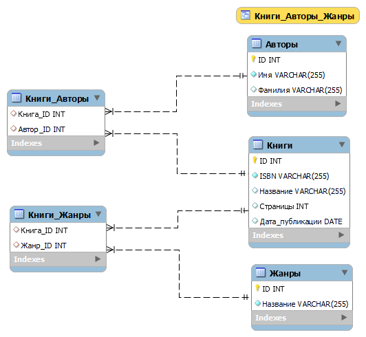

## Выполнение задания 1

### Описание задачи
Предметная область — издательство. Спроектировать структуру реляционной БД, содержащую следующие сущности:
- Книги: `ID, ISBN, авторы, название, количество страниц, жанры, дата публикации`;
- Авторы:  `ID, Имя, Фамилия`;
- Жанры: `ID, название`;

### Требования к реализации модели предметной области
- Книга может быть написана несколькими авторами;
- Книга может относиться к нескольким жанрам;

### Требования к выполненному заданию и отчёт
- Код будет запускаться на MySQL версии не ниже 5.6
  1. Скрипты разрабатывались и тестировались на версии `MySQL 8.0`.
- Cделан отдельный SQL-скрипт с тестовым набором данных
  1. `create_schema_publishing.sql` - создание схемы базы данных для сущностей в области книжного издательства.
  2. `put_tests_data_publishing.sql` - заполнение базы данных тестовым набором данных.

- Сделан отдельный SQL-скрипт который выводит название книги и ее авторов для жанра “Фантастика”.
  1. `get_fantasy_books_publishing.sql` - получение списка книг жанра "Фантастика" с их названиями и авторами.
- Cделан отдельный SQL-скрипт который выводит автора, который написал больше всего книг.
  1. `get_largest_author_publishing.sql` - выводит автора, который написал больше всего книг.
- Плюсом будет наличие визуальной схемы БД.
  1. `publishind_scheme_model.mwb` - визуальная модель схемы.

      

## Примечания
  - Использованы названия на русском языке в соответствии с заданием. Однако, я бы предпочёл использовать английский язык. Изначально названия были на английском по типу [commit e0bce98](https://github.com/Steindvart/web_robots_league_intro/commit/e0bce98d1bb0a8b61510aa5b12cd2b6685071153).
  - Также был создан View `Книги_Авторы_Жанры`, которые объединяет в себе всю информацию по книгам. `get_all_books_publishing.sql` - запускает вывод этой таблицы.