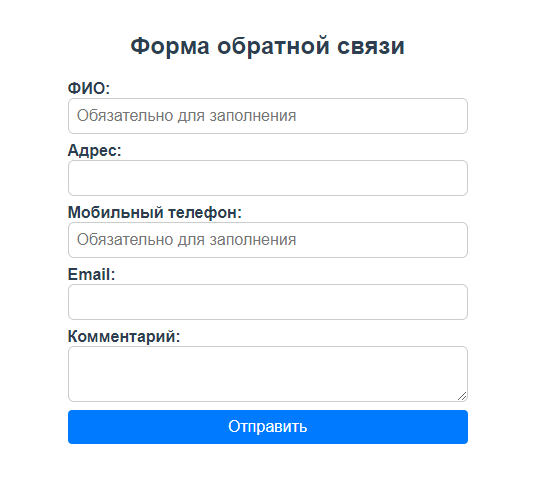
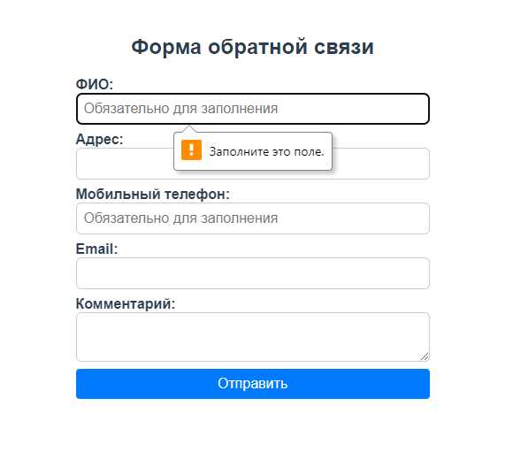
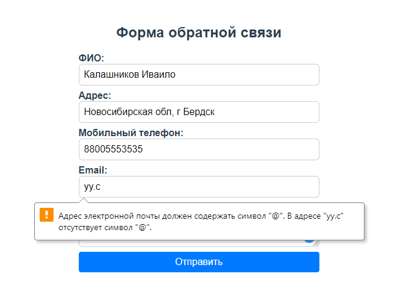
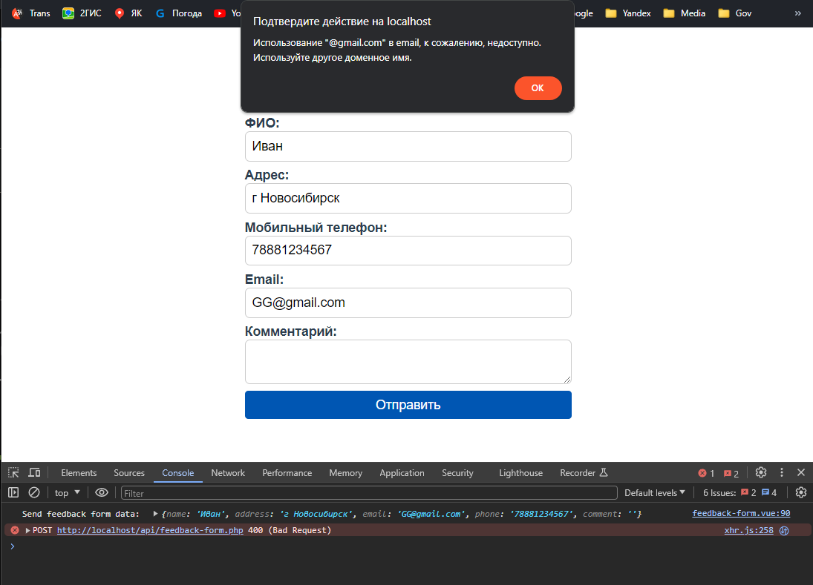
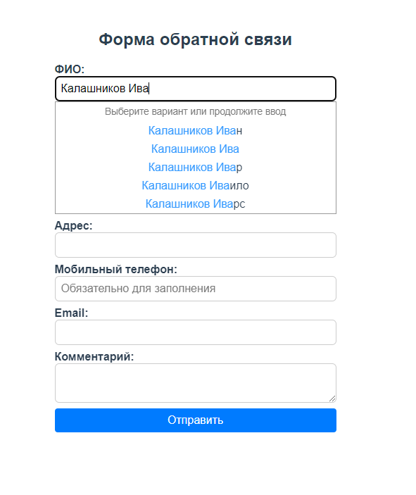

## Выполнение задания 2

### Описание задачи
- [x] Необходимо реализовать форму обратной связи, поля формы:
  - ФИО;
  - адрес;
  - email;
  - мобильный телефон;
  - комментарий;

    

### Дополнительные требования
- [x] ФИО и мобильный телефон обязательны к заполнению

    

- [x] Добавить валидацию полей мобильный телефон и email

    

- [x] На стороне бэкенда (желательно PHP) производить повторную проверку обязательных полей и если указана почта в домене `@gmail.com`, то возвращать ошибку с сообщением о том, что регистрация пользователей с таким почтовым адресом невозможна.

    

- На бэкенде складировать данные успешно заполненных форм в файл или реляционную БД, например `SQLite/MySQL`

### +1 балл от руководителя группы фронтенда (но не обязательно)
- [x] Для подсказок пользовательского ввода в поля ФИО и адрес использовать бесплатный сервис «Подсказки» от DaData
  - За основу был взят компонент [vue-dadata-suggestions](https://github.com/yzen-dev/vue-dadata-suggestions), я его немного доработал и адаптировал под проект.

      

- [x] Решить задачу с использованием фреймворка Vue.js на клиентской стороне
  - Был использован Vue.js версии 3.2.13.

## Запуск проекта

#### Сборка и запуск на `localhost`:
```
npm run serve
```

#### Сборка для запуска в продакшн:
```
npm run build
```