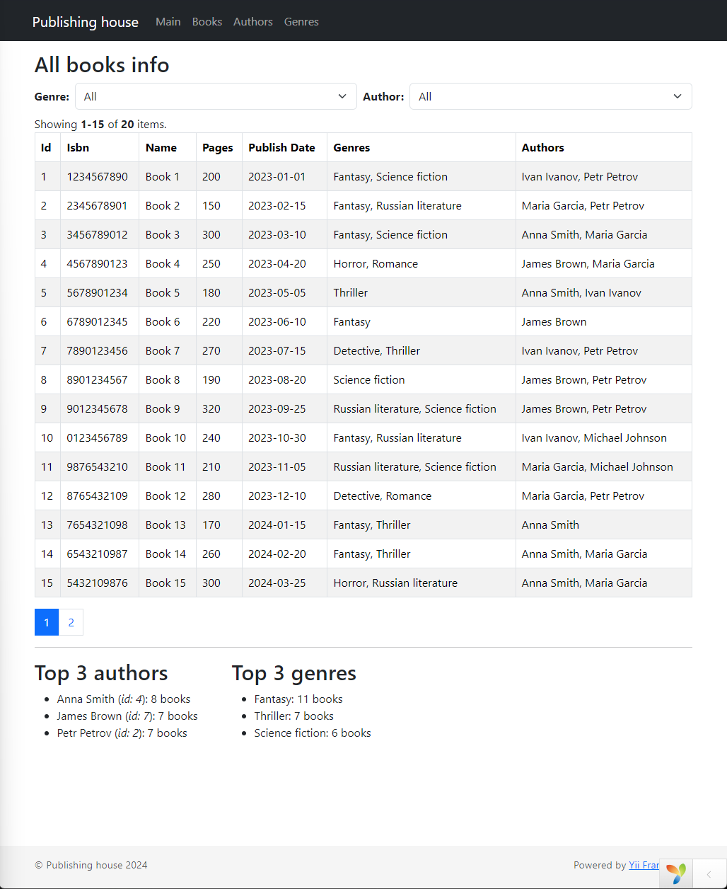

## Структура

- `publishing\` - web-приложение издательского дома на основе Yii2.
- `create_db_sql\` - sql-скрипты для создания и инициализации базы данных с тестовым набором данных.
- `img\` - изображения для демонстрации.

## Выполнение задания

### Описание и чеклист по задаче:
- [x] Главная страница - cтраница, на которой списком выводятся список книг и её данные, для просмотра читателей.
  - Опционально *:
    - [x] Фильтр по жанрам: селект, в опции селекта подгружаются все доступные жанры. По умолчанию, когда селект в состоянии “не выбрано”, просто выводятся все книги. При выборе из селекта конкретного жанра, происходит фильтрация списка книг по выбранному жанру.
    - [x] Фильтр по авторам, аналогично
    - [x] На странице выводить 2 списка: “Топ-3 авторов” и “Топ-3 жанров”. Если данных недостаточно, выводить две или одну запись, но всё в порядке убывания.

- [x] Страница “Авторы” - выводить на странице таблицу авторов. У каждого автора добавить кнопку для редактирования и удаления. Также добавить кнопку создания нового автора.
  - Опционально *:
    - [x] Фильтры по столбцам

- [x] Страница “Жанры” - выводить на странице таблицу жанров. У каждого жанра добавить кнопку для редактирования и удаления. Также добавить кнопку создания нового жанра.
  - Опционально *:
    - [x] Фильтры по столбцам

- [x] Страница “Книги” - выводить на странице таблицу книг. У каждой книги добавить кнопку для редактирования и удаления. Также добавить кнопку создания новой книги.
  - Опционально *:
    - [x] Фильтры по столбцам

### Краткая демонстрация

#### Главная страница
  

- Главная страница - применение фильтров
    

#### Страница "книги"
  

- Форма создания/редактирования книги
  
